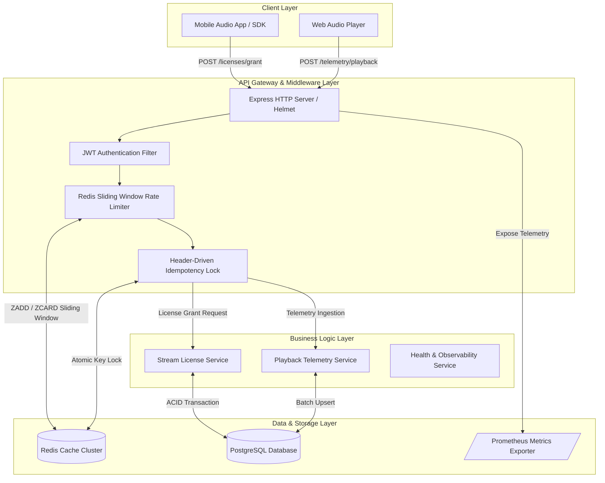
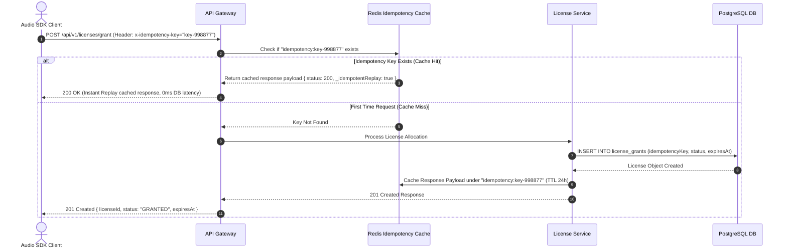
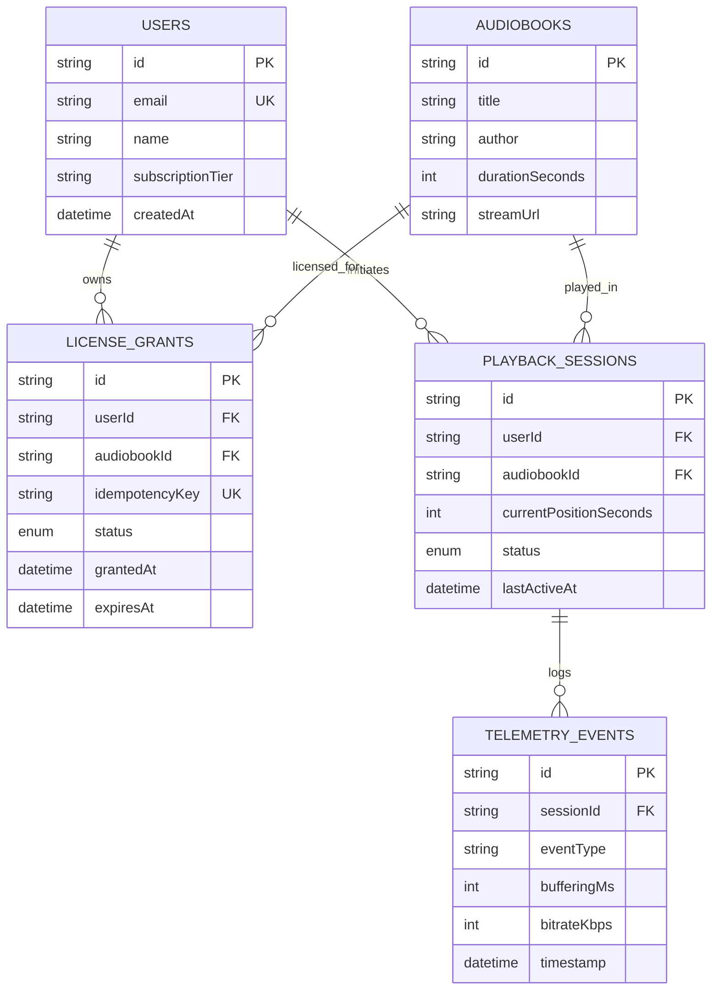

# 🎧 Audible Pulse Stream Engine

[](https://rahul0443.github.io/audible-pulse-stream-engine/)
[](https://github.com/rahul0443/audible-pulse-stream-engine/actions)
[](https://www.typescriptlang.org/)
[](https://www.postgresql.org/)
[](https://www.prisma.io/)
[](https://redis.io/)
[](https://www.docker.com/)

> **Live Web Interactive Control Plane:** [https://rahul0443.github.io/audible-pulse-stream-engine/](https://rahul0443.github.io/audible-pulse-stream-engine/)

An enterprise-grade, high-throughput **Audio Telemetry & Stream Entitlement Microservice** built for scale. Designed specifically to solve core distributed system challenges in digital streaming platforms: **atomic idempotency locks** during network retries, **distributed sliding-window rate limiting**, and **real-time playback telemetry stream ingestion**.

---

## 📋 Table of Contents
- [🌐 Live Web Interactive Sandbox](#-live-web-interactive-sandbox)
- [🏗️ System Architecture & Flowcharts](#️-system-architecture--flowcharts)
- [🔄 Idempotency & Entitlement Sequence Diagram](#-idempotency--entitlement-sequence-diagram)
- [🛢️ Entity-Relationship (ER) Database Diagram](#️-entity-relationship-er-database-diagram)
- [✨ Key Engineering Features](#-key-engineering-features)
- [📡 API Reference & JSON Payloads](#-api-reference--json-payloads)
- [📐 Architectural Trade-Off Analysis](#-architectural-trade-off-analysis)
- [📊 Observability & Operational Excellence](#-observability--operational-excellence)
- [🛠️ Local Installation & Docker Setup](#️-local-installation--docker-setup)
- [🧪 Automated Test Suite](#-automated-test-suite)
- [📄 License & Author](#-license--author)

---

## 🌐 Live Web Interactive Sandbox

Try out the live control plane directly in your browser without installing anything:
👉 **[Launch Live Control Sandbox](https://rahul0443.github.io/audible-pulse-stream-engine/)**

* **Idempotency Simulator:** Verify double-billing prevention when duplicate `x-idempotency-key` calls occur.
* **Rate Limiter Burst Simulator:** Test Redis sliding window throttling with 50+ request bursts returning `429 Too Many Requests`.
* **Telemetry Inspector:** Stream real-time playback events (HEARTBEAT, BUFFERING, QUALITY_SHIFT) with live Prometheus chart updates.

---

## 🏗️ System Architecture & Flowcharts

The system uses a layered clean architecture separating API Gateway logic, security middleware, business services, and database persistence.



---

## 🔄 Idempotency & Entitlement Sequence Diagram

This diagram illustrates how duplicate requests containing the same `x-idempotency-key` are handled without double execution:



---

## 🛢️ Entity-Relationship (ER) Database Diagram

Relational PostgreSQL schema managed via Prisma ORM:



---

## ✨ Key Engineering Features

### 1. Header-Driven Idempotency Locks
Prevents double-licensing and duplicate transaction processing when clients retry requests due to network drops. Uses Redis key locks with automatic database fallback.

### 2. Redis Sliding Window Rate Limiter
Uses atomic Redis Sorted Sets (`ZADD`, `ZREMRANGEBYSCORE`, `ZCARD`) to implement a sliding window rate limiter. Protects audio stream endpoints against request bursts while eliminating boundary spikes inherent in fixed-window algorithms.

### 3. Playback Telemetry Collector
Ingests real-time listener playback events (HEARTBEAT, BUFFERING, QUALITY_SHIFT) with automatic session state synchronization and Prometheus metrics incrementing.

### 4. Operational Excellence (OE) & Telemetry
* **Prometheus Metrics (`/metrics`):** Tracks HTTP request latencies, active stream sessions, license grant counts, and rate limit blocks.
* **Health Probes (`/health/live`, `/health/ready`):** Kubernetes-compatible liveness and readiness probe endpoints.

---

## 📡 API Reference & JSON Payloads

### Grant Audio Stream License
`POST /api/v1/licenses/grant`

**Request Headers:**
```http
Authorization: Bearer <JWT_TOKEN>
x-idempotency-key: idem_key_998877665544
Content-Type: application/json
```

**Request Body:**
```json
{
  "audiobookId": "ab_audible_project_hail_mary",
  "idempotencyKey": "idem_key_998877665544"
}
```

**Response (`201 Created`):**
```json
{
  "message": "Stream license successfully granted",
  "license": {
    "id": "lic-c9a8f2e1-4321",
    "userId": "usr_demo_123",
    "audiobookId": "ab_audible_project_hail_mary",
    "idempotencyKey": "idem_key_998877665544",
    "status": "GRANTED",
    "grantedAt": "2026-09-22T21:00:00.000Z",
    "expiresAt": "2026-09-23T21:00:00.000Z"
  },
  "isReplay": false
}
```

---

## 📐 Architectural Trade-Off Analysis

| Architectural Choice | Alternative Considered | Rationale & Selection Criteria |
| :--- | :--- | :--- |
| **Redis Sliding Window** | Fixed Window Counter | Fixed window counters allow $2\times$ burst capacity at window boundaries. Sliding window using Redis Sorted Sets provides smooth, deterministic rate control. |
| **Prisma ORM + PostgreSQL** | Raw SQL Queries | Prisma provides type-safe queries, migration history, and connection pooling while avoiding manual SQL injection vulnerabilities. |
| **Prometheus Exporter** | Custom Log Scraping | Prometheus pulls standard histogram buckets for p50/p90/p99 latency calculations with standard Grafana dashboard compatibility. |

---

## 🛠️ Local Installation & Docker Setup

### Prerequisites
* Docker & Docker Compose
* Node.js 20+

### 1-Command Setup via Docker Compose

```bash
# Clone the repository
git clone https://github.com/rahul0443/audible-pulse-stream-engine.git
cd audible-pulse-stream-engine

# Start PostgreSQL, Redis, and API Server
docker-compose up --build -d

# Verify health probes
curl http://localhost:3000/health/live
curl http://localhost:3000/health/ready
```

---

## 🧪 Automated Test Suite

```bash
# Install local dependencies
npm install

# Run Jest unit & integration tests
npm test

# Generate code coverage report
npm run test:coverage
```

---

## 📄 License & Author

Developed by **Rahul Muddhapuram** ([rmuddhap@asu.edu](mailto:rmuddhap@asu.edu)).
Licensed under the [MIT License](LICENSE).
